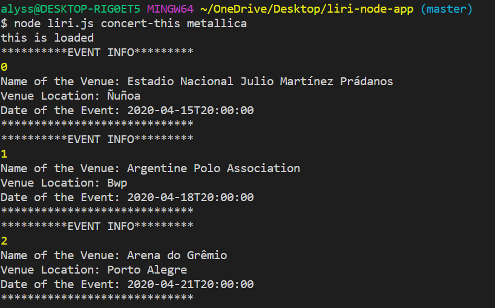
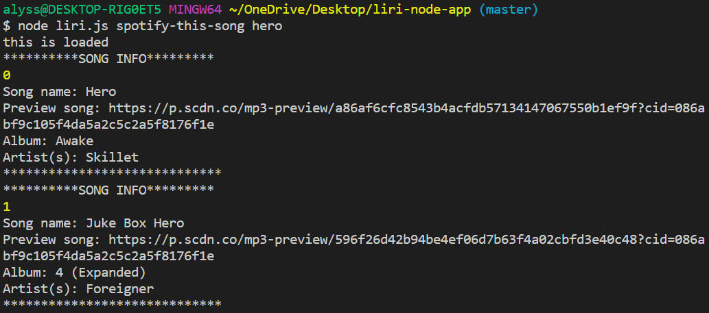
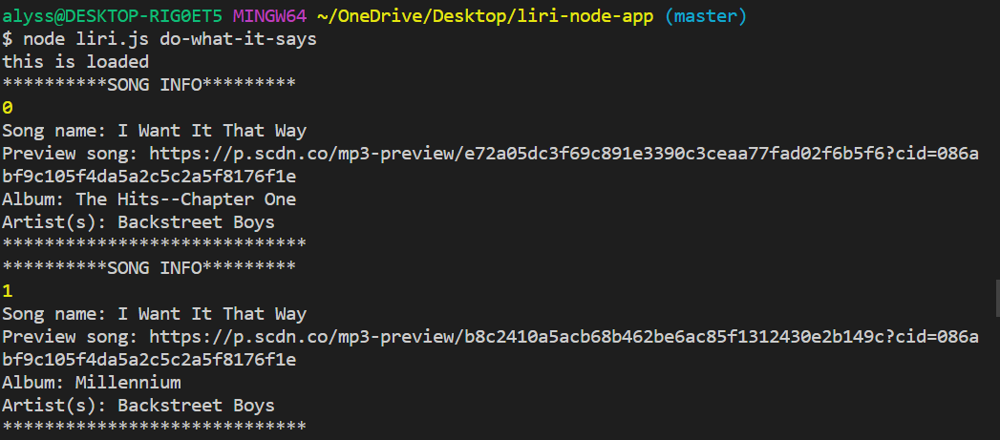
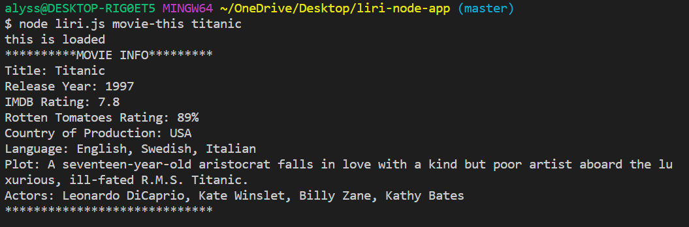

# liri-node-app

## About the APP

LIRI is a Language Interpretation and Recognition Interface. LIRI is a command line node app that takes in parameters and gives back data. The user has the option of four commands: 
* concert-this 
* Spotify-this-song 
* movie-this 
* do-what-it-says.

Step-by-step instructions:
1. Open your terminal
2. Navigate to the folder that contains liri.js
3. Run the command:
* node liri.js concert-this <name of artist or band>
  
* node liri.js movie-this <name of movie>
  
* node liri.js spotify-this-song <name of song>
  
* node liri.js do-what-it-says

# Screenshots of working node

